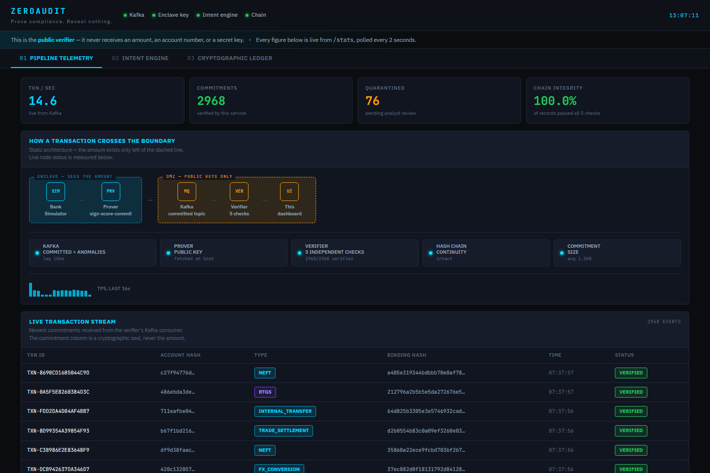
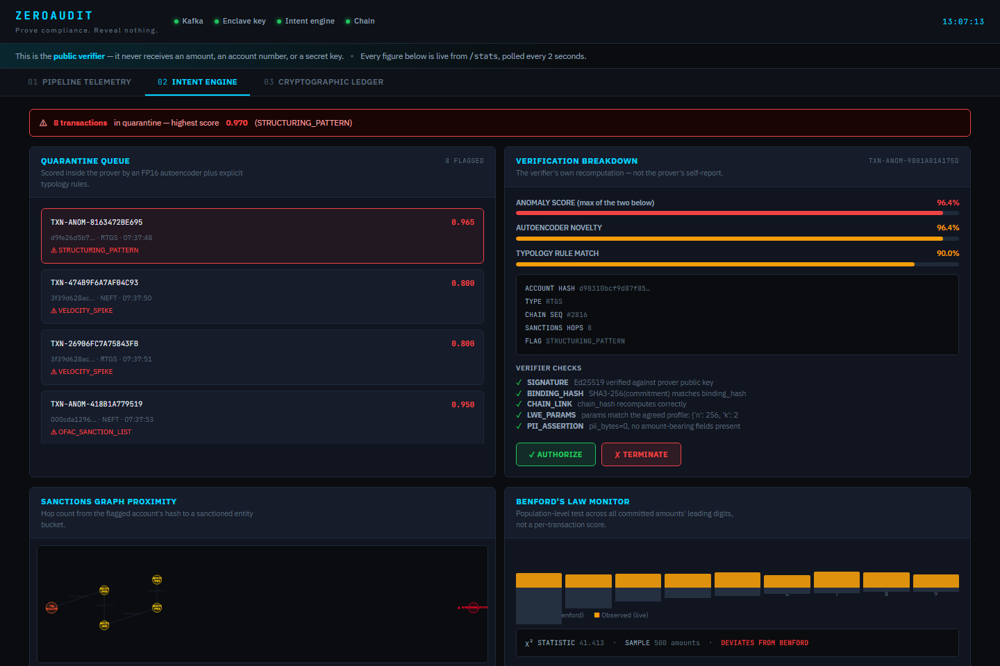
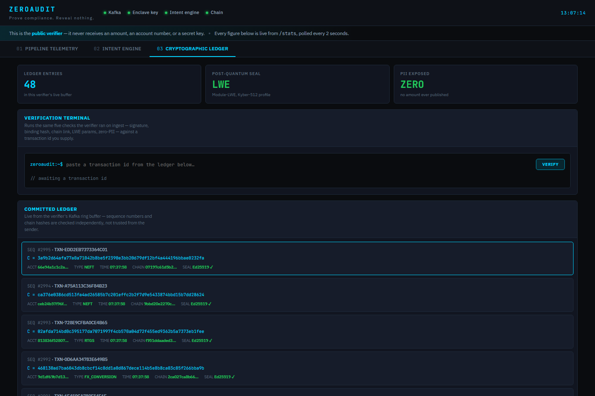

# ZEROAUDIT

**Post-quantum, privacy-preserving audit pipeline for financial transactions.**

Prove compliance. Reveal nothing.

An auditor needs to establish that a bank's transaction ledger is complete, unaltered, and free of laundering typologies. The conventional way to establish that is to hand the auditor the ledger — which turns every audit into a copy of the bank's most sensitive data sitting on someone else's infrastructure.

ZEROAUDIT replaces the data with proof. Transactions are committed under a Module-LWE lattice commitment inside the prover, chained, and signed. The auditor receives commitments, signatures, and chain links — never an amount, an account number, or a counterparty. When a specific transaction comes under scrutiny, the bank discloses **that one** transaction's opening, and the auditor verifies it against the commitment it already holds. Everything else stays sealed.

---

## Demo

Screenshots of the public verifier terminal, taken against a live `docker compose up` run — every number on these pages is fetched from the verifier API, not hardcoded.

**Pipeline telemetry** — live throughput, the enclave/DMZ boundary a transaction actually crosses, and per-node status pulled from `/sidebar/pipeline`.



**Intent engine** — a live quarantine queue with the verifier's own five-check recomputation, the autoencoder/typology score split, the real sanctions-proximity graph for the selected transaction, and the Benford population test's χ² statistic.



**Cryptographic ledger** — the committed ledger and a verification terminal that runs the same five checks against any transaction id you paste in.



---

## What it actually does

```
                    ENCLAVE BOUNDARY                    │            DMZ
                                                        │
  simulator ──▶ Kafka ──▶ prover ─────────────────▶ Kafka ──▶ verifier ──▶ dashboard
   (signs)     raw      │                          committed │  (public       :3000
                        │ 1. verify ingress sig              │   keys only)
                        │ 2. score  (FP16 ONNX autoencoder   │
                        │    + real Neo4j sanctions graph)   │  ✓ Ed25519 signature
                        │ 3. commit (Module-LWE)             │  ✓ binding hash
                        │ 4. chain  (SHA3-256 links)         │  ✓ chain continuity
                        │ 5. sign   (Ed25519)                │  ✓ LWE parameters
                        ▼                                    │  ✓ zero-PII assertion
                Cassandra   Neo4j                             │
              (durable ledger) (real OFAC SDN list)           │
                                                        │
        sees raw amounts                                │   never sees an amount
        holds every secret                              │   holds only public keys
```

The boundary is the design. The intent engine runs **inside** the prover because scoring needs the amount, and that is the last point at which the amount legitimately exists. Only the resulting scalar score crosses into the DMZ.

| Layer | Technology | Role |
|---|---|---|
| Commitment | Module-LWE (Kyber-512 profile) | Post-quantum binding + hiding commitment |
| Attestation | Ed25519 | Proves the enclave authored each record |
| Tamper-evidence | SHA3-256 hash chain | Detects edit, insert, delete, reorder |
| Intent engine | FP16 ONNX autoencoder + typology rules | Anomaly detection on metadata + amount |
| Sanctions graph | Neo4j 5, loaded with the real OFAC SDN list | Cypher shortest-path proximity to a sanctioned entity |
| Ledger | Apache Cassandra 4.1 | Append-only, day-partitioned, idempotent writes |
| Transport | Apache Kafka 7.6 | Ordered, replayable, topic-isolated |
| Verifier API | FastAPI | External DMZ, zero PII |
| Terminal | Static HTML + nginx | Live audit view |

---

## Cryptography

### Commitment scheme

Over the ring `R_q = Z_q[X]/(X^N + 1)` with the Kyber-512 profile `n=256, k=2, q=3329, η=2`:

```
KeyGen:   A ← expand(seed);  s,e ← CBD(η);  t = A·s + e        public: (seed, t)
Commit:   r  = HMAC-SHA256(K_master, txn_id)
          u  = Aᵀ·r + e₁
          v  = ⟨t, r⟩ + e₂ + encode(m)
          C  = (u, v),   binding_hash = SHA3-256(C)
Open:     recompute C from (m, r) using the PUBLIC key, compare constant-time
```

- **Binding** — `encode()` spreads the full **64-bit** amount one bit per coefficient scaled by `⌊q/2⌋ = 1664`. Two distinct amounts differ in at least one coefficient by ~q/2, which no CBD(η=2) error term (max |e| = 2) can bridge.
- **Hiding** — `(u, v)` is pseudorandom under Module-LWE. The blinding vector and error terms derive from a secret master key and are discarded.
- **Post-quantum** — reduces to Module-LWE, believed hard for quantum adversaries.

### Tamper-evident chain

```
chain_hashᵢ = SHA3-256( chain_hashᵢ₋₁ ‖ binding_hashᵢ ‖ txn_idᵢ ‖ tsᵢ )
```

The Ed25519 signature covers `chain_hash`, so re-chaining a modified ledger requires the signing key. Editing, deleting, reordering, or inserting any record breaks every link after it.

### Selective disclosure

The auditor continuously verifies signatures, chain continuity, and the zero-PII assertion **without any secret**. To audit one specific transaction:

```bash
# bank discloses ONE opening
curl -X POST localhost:8000/audit/open \
  -H 'Content-Type: application/json' \
  -d '{"txn_id":"TXN-...","amount_cents":15000000}'

# auditor verifies it against the commitment already published
curl -X POST localhost:8001/verify/opening \
  -H 'Content-Type: application/json' \
  -d '{"txn_id":"TXN-...","amount_cents":15000000,"blinding_seed_hex":"..."}'
```

A bank that misstates the amount cannot produce a blinding factor that makes the recomputation match. Every other record stays sealed.

---

## Intent engine

An undercomplete autoencoder — `10 → 6 → 3 → 6 → 10`, tanh, trained on **normal traffic only** — exported as a float16 ONNX graph. Reconstruction MSE is the novelty score. Training on normals alone is deliberate: labelled fraud is scarce and only teaches the frauds someone already caught.

Feature standardisation and the error computation are both **inside the graph**, so inference is one ORT call returning a scalar and the `mu`/`sigma` can never drift out of sync with the weights.

Novelty is blended with a deterministic **typology rules** layer (`score = max(novelty, typology)`). AML regulation requires that a flag be explainable — an analyst can act on `STRUCTURING_PATTERN`, but not on "reconstruction error 1.4" — so whenever a rule matches, the reported reason names the typology.

### Measured performance

Reproduce with `python -m ml.evaluate` (40,010 events, 5% anomalous, held-out seed):

```
ROC AUC                 : 0.69
at the 0.75 quarantine line:
  recall                : 39.6%
  false-positive rate   : 1.03%

recall by typology:
  structuring                 100.0%      ← rules
  sanctions_adjacent          100.0%      ← rules
  velocity_burst               36.3%      ← autoencoder
  benford_violation             5.8%
  offhours_settlement           0.8%

incident-level recall (velocity bursts): 6 of 6 distinct bursts (100%)
macro-average recall across typologies : 48.6%
flag attribution: autoencoder 44% | typology rules 56%
```

**Reading these numbers honestly.** Structuring and sanctions proximity are caught outright. Velocity bursts are caught **as incidents** — 100% of bursts are flagged, but only 36% of individual legs, because the first transaction in a burst is not yet a burst; detection is inherently lagged.

Benford and off-hours recall are low *by design*. A single amount with a leading 9 occurs in ~4.6% of clean traffic, and ~3% of legitimate settlement happens overnight. Neither is grounds to freeze a transaction. Those are **population-level** signals, handled by a sliding-window Pearson chi-squared test instead:

```
clean stream      : chi2 =     5.95   suspicious = False
10% fabricated    : chi2 =   456.85   suspicious = True
25% fabricated    : chi2 =  2803.89   suspicious = True
                    critical value (p=0.05, 8 dof) = 15.51
```

The 1.03% false-positive rate is the number that decides whether an alert queue is staffable.

### Sanctions proximity is a real graph query

`graph_hops_to_blacklist()` used to bucket accounts by the first few hex characters of their hash — a stand-in explicitly documented as "in production this becomes a Neo4j query." It now is one. `docker compose up` loads a **Neo4j** instance with the actual current [U.S. Treasury OFAC SDN list](https://sanctionslistservice.ofac.treas.gov/api/download/SDN.CSV) — ~19,300 real designated entities, refreshable with `python -m scripts.fetch_sanctions_list` — and the prover checks proximity with a real Cypher shortest-path query:

```cypher
MATCH (a:Account {hash: $hash})
OPTIONAL MATCH p = shortestPath((a)-[:TRANSACTED_WITH*1..8]-(s:SanctionedEntity))
RETURN length(p) AS hops, s.name, s.program
```

Verified against the live graph:

```
ACC-1050           -> no path (clean)
ACC-1101           -> no path (clean)
ACC-SANC-RBI-02    -> {hops: 2, name: 'URANIUM PROCESSING AND NUCLEAR FUEL COMPANY'}
ACC-SANC-FATF-03   -> {hops: 3, name: 'SIERRA'}
```

**What's real and what isn't, precisely.** The ~19,300 sanctioned entities are the actual published OFAC list — real names, real program tags (`RUSSIA-EO14024`, `SDGT`, `IRAN-EO13902`). The query mechanism is a real graph database doing a real traversal, not a lookup table. What's still synthetic is *which demo accounts sit at which hop distance* from those entities (`scripts/load_sanctions_graph.py` seeds twelve fixed IDs — `ACC-SANC-OFAC-01` etc. — at 1/2/3 hops) — for the same reason the transaction stream itself is synthetic: no public dataset of real interbank relationships exists, for the same privacy reasons no public dataset of real bank transactions exists. The Neo4j client fails safe: if the graph is unreachable, it returns a neutral result and marks itself degraded rather than falling back to the hash-prefix heuristic it replaced.

---

## Getting started

### Prerequisites
- Docker ≥ 20.10, Docker Compose ≥ 2.0

### Run

```bash
git clone https://github.com/VishnuAravind-RG/zeroaudit.git
cd zeroaudit

python -m scripts.gen_keys > .env     # deterministic key material
docker compose up --build -d
```

Cassandra and Kafka take ~60s to report healthy. Neo4j comes up alongside them and a one-shot loader (`sanctions-init`) populates it with the real OFAC SDN list (~19,300 entities, a few seconds) before the prover is allowed to start — everything else waits on health checks.

> **Why `.env` matters.** Without it every container mints ephemeral keys at boot, so a restarted prover can no longer open any commitment it published earlier and the verifier rejects every prior signature. Fine for a smoke test, useless for a ledger.

### Verify it is working

```bash
curl localhost:8001/health          # consumer_connected + has_prover_key must be true
curl localhost:8001/stats           # tps, verified, signature_verified, chain_broken
curl localhost:8001/chain/verify    # {"intact": true, ...}
curl localhost:8001/keys            # public keys the verifier checks against
curl localhost:8000/stats           # prover throughput + intent engine backend
```

`/stats` after ~60 seconds:

```json
{
  "tps": 14.8,
  "total_commitments": 892,
  "verified": 892,
  "failed": 0,
  "signature_verified": 892,
  "chain_broken": 0,
  "kafka_lag_records": 3,
  "pii_bytes": 0
}
```

`chain_broken: 0` and `failed: 0` are the assertions that matter: every record the DMZ received carried a valid enclave signature and linked correctly to its predecessor.

### Dashboard

[http://localhost:3000](http://localhost:3000) — polls the verifier API every 2s. If the verifier is unreachable it says so rather than rendering a synthetic feed.

---

## Retraining the intent engine

```bash
python -m ml.train_autoencoder --samples 100000 --epochs 250
python -m ml.evaluate
docker compose restart prover
```

Training runs in ~16s on CPU. Forward/backward passes and Adam are written directly in NumPy: the network is ~350 parameters, the explicit gradients are clearer than a framework dependency, the run is deterministic under a fixed seed, and the image avoids a multi-hundred-MB torch install. Export verifies fp32 and fp16 agree (median relative error ~0.05%) before writing the file.

---

## Service endpoints

| Service | Port | Notes |
|---|---|---|
| Prover | 8000 | **Enclave side.** Holds master key, lattice secret, signing key. Sees amounts. |
| Verifier | 8001 | **DMZ.** Public keys only. Never receives an amount. |
| Dashboard | 3000 | Static HTML, polls :8001 |
| Kafka | 9092 | External listener |
| Cassandra | 9042 | CQL |
| Neo4j | 7687 (bolt), 7474 (browser) | Real OFAC sanctions graph — prover-only, not DMZ-reachable |

**Prover:** `/health` `/stats` `/keys` `/chain/verify` `/audit/open` `/verify` `/ledger/export`
**Verifier:** `/health` `/stats` `/keys` `/transactions` `/anomalies` `/anomaly/{id}` `/chain/verify` `/verify/opening` `/resolve/{id}` `/ledger/export` `/charts/*` `/sidebar/*` `/stream`

---

## Project layout

```
zeroaudit/
├── prover/                     ENCLAVE SIDE — every secret lives here
│   ├── crypto/lwe.py           Module-LWE commitments, NumPy ring arithmetic
│   ├── crypto/commitment.py    Ledger, hash chain, selective disclosure
│   ├── crypto/signature.py     Ed25519 attestation
│   ├── cassandra_store.py      Query-driven Cassandra data model
│   ├── consumer.py             Kafka ingest: verify → score → commit → chain → sign
│   └── main.py                 Prover API
├── verifier/                   DMZ — public keys only
│   ├── verify.py               Signature, binding, chain, params, PII checks
│   ├── anomaly_detector.py     Intent engine (executes in the prover)
│   ├── sanctions_graph.py      Real Neo4j Cypher client (executes in the prover)
│   ├── kafka_client/consumer.py
│   └── dashboard.py            Verifier API
├── ml/
│   ├── train_autoencoder.py    NumPy training → FP16 ONNX export
│   └── evaluate.py             Reproducible evaluation harness
├── models/                     Committed model artefact + calibration sidecar
├── services/neo4j/sdn_snapshot.csv   Real U.S. Treasury OFAC SDN list snapshot
├── simulator/bank_sim.py       Signed synthetic traffic with real anomalies
├── dashboard/index.html        Audit terminal (live API)
├── scripts/
│   ├── gen_keys.py
│   ├── fetch_sanctions_list.py    Refresh the real OFAC snapshot
│   └── load_sanctions_graph.py    Load it into Neo4j + seed the demo graph
└── tests/                      153 tests
```

---

## Tests

```bash
pip install -r requirements.txt
pytest
```

```
tests/test_crypto.py          45 passed    LWE, binding, chain, Ed25519
tests/test_verifier.py        51 passed    verification, intent engine, charts
tests/test_intent_engine.py   23 passed    the shipped ONNX artefact
tests/test_integration.py     20 passed    full pipeline + tamper attacks
                             139 passed
```

The tamper suite asserts that edited, deleted, reordered, and re-signed records are all rejected, and that a PII field injected into an envelope fails verification.

---

## Configuration

| Variable | Default | Description |
|---|---|---|
| `ZEROAUDIT_MASTER_KEY` | — | 32-byte hex. Derives per-transaction blinding factors. |
| `LWE_SEED_HEX` | — | 32-byte hex. Seeds the lattice public matrix and secret. |
| `SGX_SIGNING_KEY_B64` | — | 32-byte base64. Ed25519 signing seed. |
| `CASSANDRA_ENABLED` | `false` | Prover only. Verifier must never hold a write handle. |
| `ONNX_MODEL_PATH` | `models/intent_autoencoder_fp16.onnx` | Intent engine artefact |
| `ANOMALY_THRESHOLD` | `0.75` | Quarantine line |
| `INGRESS_REQUIRE_SIGNATURE` | `false` | Reject unsigned inbound transactions |
| `SIM_TPS` | `15` | Simulator rate |
| `SIM_ANOMALY_RATE` | `0.05` | Injected anomaly fraction |

---

## Design decisions worth defending

The choices below were each a fork in the road with a real alternative. Stated so a reviewer doesn't have to reverse-engineer the reasoning from the diff.

| Decision | Alternative considered | Why this one |
|---|---|---|
| Score = `max(novelty, typology)`, not a weighted sum | `0.5·novelty + 0.5·typology` | A confident rule (sanctions hop = 1) must never get diluted by a calm autoencoder, and vice versa. Averaging can let a 0.95 typology match and a 0.1 novelty score cancel into a 0.5 that misses the quarantine line. |
| Autoencoder trained on normal traffic only | Supervised classifier on labelled fraud | Labelled fraud is scarce and backward-looking — it only teaches frauds someone already caught. An autoencoder flags anything structurally unlike normal traffic, so a novel pattern is anomalous by construction. |
| 6→3→6 bottleneck, not wider | 16→8→16 | Measured directly: widening the bottleneck let the model reconstruct anomalies *too*, collapsing AUC from 0.78 to 0.43. A tighter bottleneck is a feature, not a compromise — it's what forces the network to only learn genuine regularities. |
| Feature standardization baked into the ONNX graph | Standardize in Python before inference | Two code paths computing `mu`/`sigma` can drift out of sync after a retrain. Putting `Sub`/`Div` nodes in the graph itself makes that class of bug structurally impossible. |
| Explicit NumPy forward/backward pass | PyTorch/TensorFlow | The network is ~350 parameters. A framework import costs hundreds of MB in the image for a model this size, and hand-written gradients keep the training run fully deterministic under a fixed seed — useful when a claimed AUC needs to be exactly reproducible. |
| Cassandra partitioned by UTC day | One partition per account, or unbounded | An unbounded partition is the classic Cassandra failure mode — it grows forever and query latency degrades. Day-bucketing caps partition size at roughly one day of ingest regardless of ledger age. |
| Verifier fetches prover's public key over HTTP at boot, trusts on first use | Bake the key into a config file at build time | Matches how the system is honestly described: this simulates enclave separation, not hardware attestation. Documented as a limitation rather than dressed up as something stronger (see Threat model below). |
| 64-bit amount encoding (1 bit per lattice coefficient) | Encode a hash of the amount instead | Binding needs the recomputation to be exact and cheap for the auditor to check against a public key — hashing the amount would need the auditor to already know it to verify, defeating the purpose of a commitment. |
| Real Neo4j graph loaded with the actual OFAC SDN list | Keep the hash-prefix heuristic, or fabricate a synthetic sanctions list | The README already named this as the intended production path; leaving a documented stand-in in place indefinitely is worse than not documenting it. The government publishes the real list specifically for integration into screening systems like this one — there's no reason to fake data that's freely available. |
| Sanctions client fails to a neutral result, not the old heuristic | Fall back to hash-prefix bucketing if Neo4j is unreachable | Falling back to the thing just replaced would silently reintroduce the exact simulation this was built to remove. A visible "degraded" status is honest; a silent heuristic fallback is not. |

---

## Threat model — what this does and does not defend against

**Defended.** A dishonest prover cannot restate an amount after publication (binding), forge a record (Ed25519), or quietly rewrite history (hash chain). A compromised DMZ leaks nothing: it holds no amounts and no secrets. A compromised Kafka topic cannot inject records without the signing key.

**Not defended.**

- **SGX is simulated.** The prover is a normal container — there is no SGX-capable hardware in this environment to run it on for real, and that's a physical constraint, not a design choice. The enclave boundary is enforced by process and network separation, not by hardware attestation. Running this under real SGX (or Gramine) would require a remote-attestation handshake before the verifier trusts the signing key. The current design is honest about where that key comes from: the verifier fetches it over HTTP at startup and trusts it on first use. What's genuinely hardened, using real Linux/Docker primitives rather than defaults: the prover container runs `read_only: true` with `cap_drop: [ALL]` and `no-new-privileges` — a container holding the master key, lattice secret, and signing key has no writable filesystem and no Linux capability it doesn't strictly need, so a remote-code-execution bug in any dependency has nowhere to drop a payload and nothing to escalate with.
- **Key custody.** Keys come from environment variables. Production would use an HSM or KMS.
- **A prover that lies at ingest.** ZEROAUDIT proves the published ledger matches what the prover committed. It cannot prove the prover was shown every transaction — that requires attestation over the source system.

---

## License

Provided for demonstration and educational purposes. Contact the author for licensing details.

---

*ZEROAUDIT — your data doesn't need to leave your vault to prove it's clean.*
